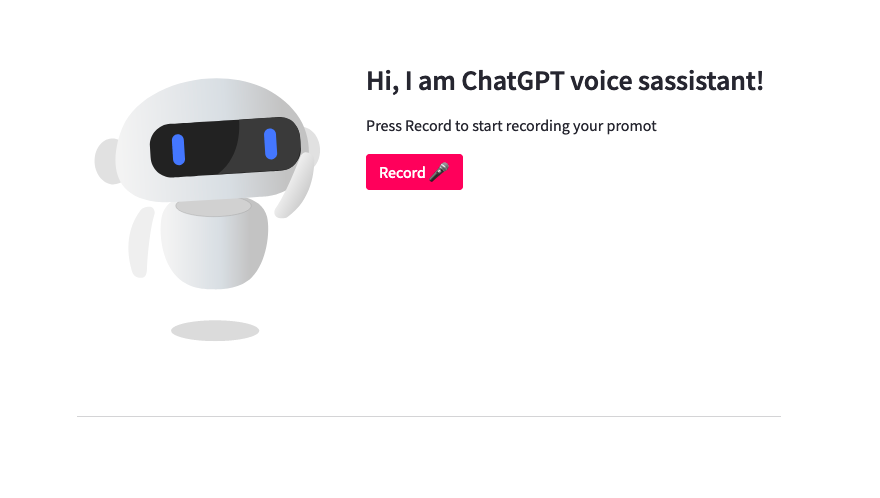

# ML Studio - ChatGPT Voice Assistant



### Installation of packages
```bash
conda create -n chagpt -n python=3.9
conda activate chatgpt

pip install openai
pip install streamlit
pip install streamlit-lottie

pip install pyaudio
```

### Setting up OpenAI API Key


### Running
